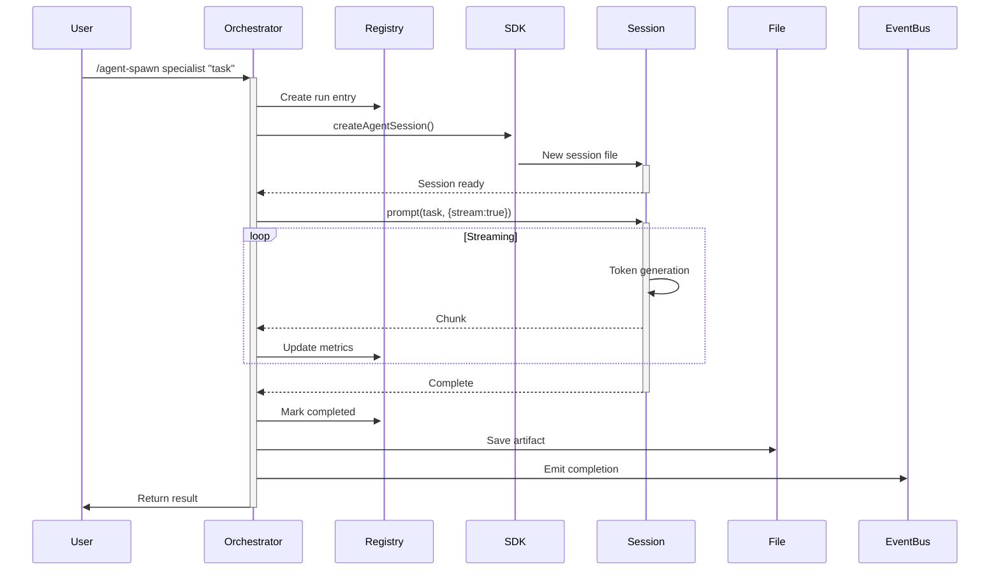

# 🐉 Subagent Execution

## Overview

Subagents are now executed using the **pi-coding-agent SDK** (`createAgentSession`), providing real AI-powered task execution with proper session management.

## Architecture

### How It Works

1. **Parent creates subagent entry** in DraconicRunRegistry
2. **SDK Session created** via `createAgentSession()`
3. **Task executed** via `session.prompt(task, { stream: true })`
4. **Output streamed** and collected incrementally
5. **Metrics updated** during execution
6. **Artifacts saved** to `~/.0xkobold/agents/outputs/`
7. **Status updated** (completed/error)
8. **Events emitted** for TUI updates

### File Locations

- **Session dir**: `~/.0xkobold/subagents/sessions/`
- **Artifacts**: `~/.0xkobold/agents/outputs/{runId}.json`
- **State**: `~/.0xkobold/orchestrator-state.json`

## Usage

### Basic Spawn

```typescript
// Via TUI command
/agent-spawn specialist "implement auth"

// Via tool
agent_orchestrate({
  operation: "spawn_subagent",
  subagent: "specialist",
  task: "implement user authentication"
})
```

### Quick Spawns

```bash
/specialist "implement feature"    # 👨‍💻 Coding specialist
/researcher "analyze codebase"     # 🔬 Research agent
/planner "design architecture"     # 📋 Planning agent
/reviewer "review PR"              # 👁️ Code reviewer
```

### Agent Controls

```bash
/agents                    # List all with status
/agent-stop <id>           # Graceful stop
/agent-resume <id>        # Resume paused
/agent-kill <id>          # Force kill
```

## Monitoring

### Real-Time Updates

- **Header widget** (above editor): Shows live tree
- **Footer status**: Shows active task
- **Events**: `agent.spawned`, `agent.completed`, `agent.error`

### View Status

```bash
/agent-tree              # Full hierarchy
/agent-tree-lines        # Compact lines
/artifacts               # Browse outputs
/artifact-latest         # Most recent result
```

## Configuration

### Concurrent Limit

```typescript
const MAX_CONCURRENT_SUBAGENTS = 3; // Configurable
```

Auto-queues when limit reached.

### Model Inheritance

Subagents **inherit parent's model** by default:

```typescript
const sessionOptions = {
  model: ctx.model, // Same as parent
  thinkingLevel: "medium",
};
```

## Implementation Details

### Spawn Flow



### Error Handling

| Error Type | Behavior |
|------------|----------|
| Session creation fail | Mark error, return exitCode 1 |
| Execution error | Catch, mark error, save partial output |
| Max concurrent | Queue, wait with notification |
| Token limit | Warn via token predictor |

### Metrics Tracked

- `duration`: Total execution time (ms)
- `tokens.input`: Estimated input tokens
- `tokens.output`: Generated output tokens
- `apiCalls`: Number of API calls (1 per execution)

## Keyboard Shortcuts

| Shortcut | Action |
|----------|--------|
| `ctrl+shift+a` | Show agent tree |
| `ctrl+shift+s` | Quick spawn specialist (hint) |
| `ctrl+shift+r` | Quick spawn researcher (hint) |
| `ctrl+shift+k` | Kill running agent |

## Troubleshooting

### Subagent not executing

1. Check model availability: `ctx.model` must be defined
2. Check disk space: Sessions need ~10KB each
3. Check permissions: `~/.0xkobold` must be writable

### No output shown

1. Task may be too short (minimize streaming)
2. Check artifact: `/artifact <runId>`
3. Check status: `/agent-tree`

### Session creation failed

```
❌ Failed to create subagent session: <error>
```

Usually indicates:
- Missing `agentDir` permissions
- No available models
- Disk full

## Future Enhancements

- **Parallel execution** across multiple models
- **Chain dependencies** (agent A waits for B)
- **Result aggregation** combining multiple agents
- **Auto-retry** on failure with backoff

## Version History

| Version | Change |
|---------|--------|
| 1.0.0-draconified | SDK-based execution (current) |
| 0.x | Simulated execution (stub) |
